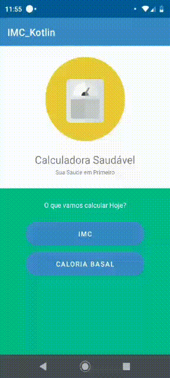

# Calculadora Basal e IMC 

### IMC

- É Necessário colocar o seu Tamanho(cm) e o seu Peso(kg)

- se não colocar Peso ou o Tamanho vai dá ERRO!!!

### Taxa metabólica basal

- É Necessário colocar o Sexo, Tamanho(cm) e o seu Peso(kg)

- Se não colocar o Sexo, Tamanho(cm) e o seu Peso(kg) vai dá ERRO!!!

